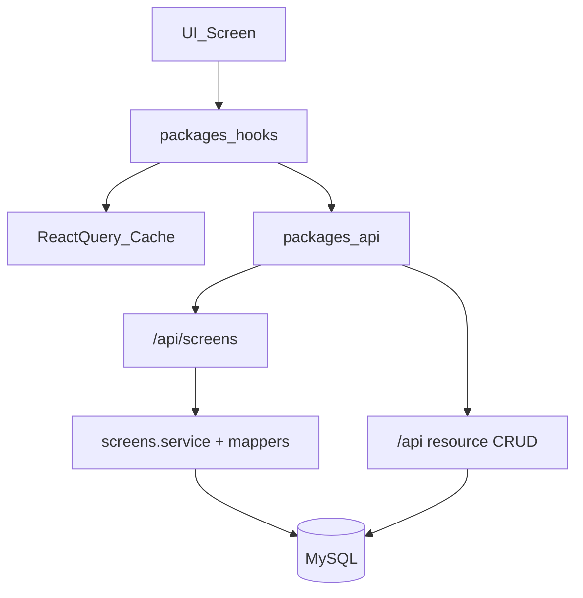
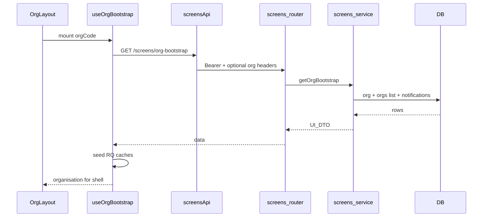

# API Architecture

## Rollback

| Commit / branch | Meaning |
|-----------------|---------|
| `d279c9a` / `api-architecture-refactor` | Client + React Query layer (restore before screen APIs) |
| `ce8f917` / `master` | Pre client-refactor working app |
| `screen-api-redesign` (this branch) | Screen-oriented `/api/screens/*` + UI migration |

```bash
# Leave screen APIs; keep shared client
git checkout api-architecture-refactor

# Or fully restore pre-refactor master
git checkout master

# Hard reset this branch only
git checkout screen-api-redesign
git reset --hard d279c9a
```

## Why these changes

Previously the UI was **resource-oriented**: each screen assembled itself from many small CRUD/system GETs (org + orgs list + notifications; 9 employee-form lookups; get-day + jobs; dashboard pulled 100 timesheets and used mock charts).

Large platforms (Notion, Linear, Slack-style BFFs) expose **screen-oriented reads**: one endpoint returns a stable UI DTO. Mutations stay on resource APIs.

## Architecture layers



### Folder structure

```
backend/
  routes/screens/index.js
  controller/screens.controller.js
  service/screens.service.js
  mappers/screen.mapper.js

packages/types/     # OrgBootstrapView, HomeBootstrapView, …
packages/api/       # screens.api.ts (+ existing resource APIs)
packages/hooks/     # useOrgBootstrap, useHomeBootstrap, …
```

Existing CRUD under `/api/organisations`, `/api/employees`, `/api/system`, etc. **remains** for mutations and screens not yet migrated.

## Screen → endpoint map (Phase 1)

| Screen | Before | After | Endpoint |
|--------|--------|-------|----------|
| Org shell (layout + switcher + bell seed) | 3 GETs | **1** | `GET /api/screens/org-bootstrap?org_code=` |
| Home (web + mobile) | 2 GETs | **1** | `GET /api/screens/home` |
| Create employee (step ≥ 1) | 9 GETs | **1** | `GET /api/screens/employee-form` |
| Timesheet day editor | 2 GETs | **1** | `GET /api/screens/timesheet-day-editor` |
| Org dashboard | 1 list (≤100) + mock charts | **1** live overview | `GET /api/screens/dashboard` |

Approximate **first-paint savings**: ~**11–14 fewer requests** across a typical login → home → org → create employee → day edit path (exact count depends on ACL).

## Endpoint responsibilities & response models

All responses use the existing envelope `{ data, info }`.

### `GET /screens/org-bootstrap?org_code=`

Token only (resolves org by code — deep-link safe).

```ts
OrgBootstrapView {
  organisation: /* ACL + settings (same shape as org get) */
  organisations: OrganisationMembership[]
  notifications: { items: AppNotification[]; unread_count: number }
}
```

Client seeds React Query keys for org get, orgs list (`rows_per_page: 50`), and notifications list.

### `GET /screens/home`

```ts
HomeBootstrapView {
  organisations: OrganisationMembership[]
  invitations: OrganisationInvitation[]
}
```

### `GET /screens/employee-form`

Token + OrgValidate. ACL: employee create or edit.

```ts
EmployeeFormLookupsView {
  roles, areas, nok_relations, employment_status, employment_types,
  timesheet_submission_frequencies, payroll_calendars, award_rates
}
```

### `GET /screens/timesheet-day-editor`

Query: `mode=self|management`, `timesheet_day_id`, `employee_id?`  
Returns day editor payload **plus** `available_jobs: JobOptionView[]`.  
Same self/management ACL as existing get-day routes.

### `GET /screens/dashboard`

Token + OrgValidate. ACL: timesheetManagement.list **or** timesheet.list.  
Server computes KPIs, status donut, weekly/monthly progress, productivity trend, team activity, recent notifications — **no mock chart constants**.

## Request / response flow



## Caching strategy

| Layer | Behaviour |
|-------|-----------|
| React Query | `createAppQueryClient()` — 30s staleTime, dedupe, AbortSignal |
| Screen hooks | Bootstrap staleTime 30s; employee-form 5m |
| Org Redis | Reused for organisation payload inside bootstrap |
| Notifications | Seeded by bootstrap; bell polls `/notifications/list` after staleTime |

### Invalidation

- Invitation accept/reject → invalidate `screens.home`, organisations, invitations
- Mutations (employees, timesheets, …) continue to invalidate resource prefixes
- Prefer invalidating `["screens", "dashboard", orgCode]` after timesheet approve/submit when wiring further (optional follow-up)

## Auth & security

- `/screens/*` mounted behind `TokenValidate`
- Org-scoped routes use `OrganisationValidate` (except org-bootstrap / home)
- Dashboard and day-editor reuse the same ACL and employee scoping as list/get-day
- Mappers omit secrets and avoid exposing integration credentials in screen DTOs

## Client HTTP layer (unchanged principles)

See also earlier work on this branch lineage:

- `ApiError` normalisation, GET retry, timeouts, AbortSignal
- Resource APIs for writes: `employeesApi.create`, timesheet save/approve, etc.

## How to add a new screen endpoint

1. Add aggregation in `backend/service/screens.service.js` (+ mapper if needed).
2. Expose in `screens.controller.js` + `routes/screens/index.js`.
3. Add a typed view model in `packages/types`.
4. Add method on `screensApi` and a hook under `queryKeys.screens.*`.
5. Migrate the screen to the hook; seed related resource caches if child screens still use CRUD gets.
6. Document the screen → endpoint row in this file.
7. Keep mutations on resource routes unless there is a strong reason not to.

## Phase 2 (not in this branch)

- Jobs list slim DTO
- Settings shells (holiday/payroll/org)
- Reports pay-summary aggregate
- Timesheet week-view (days without full task timelines)

## Performance improvements (Phase 1)

| Area | Improvement |
|------|-------------|
| Org navigation | 3 → 1 network round-trip for shell data |
| Home | Parallel 2 → 1 |
| Employee create | 9 → 1 lookup payload |
| Day editor | 2 → 1 (day + jobs) |
| Dashboard | No over-fetch of 100 rows for charts; live KPIs instead of mocks |
| Maintainability | UI no longer orchestrates multi-resource fan-out for these screens |
