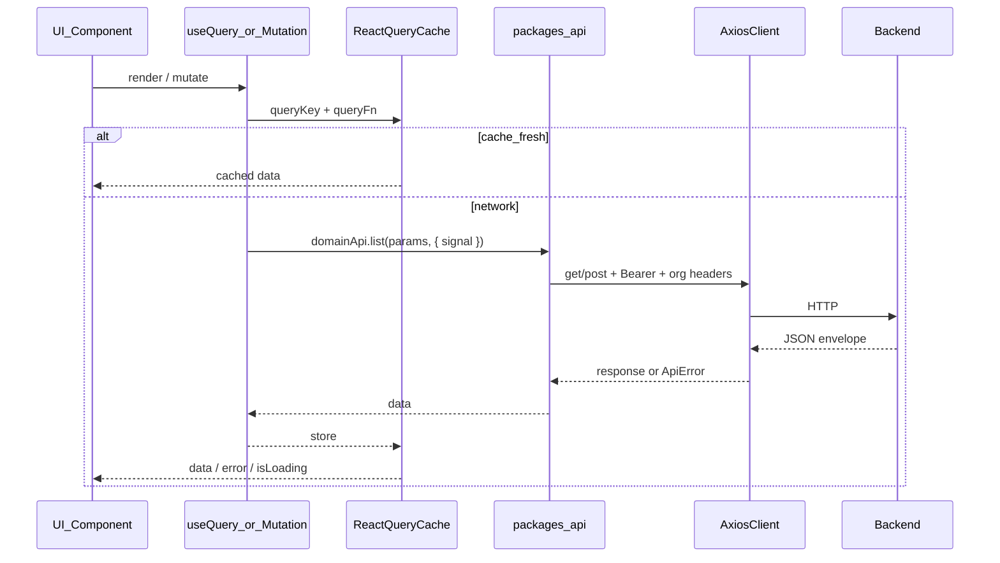

# API Architecture

Restore point: `master` @ `ce8f917` (pre-refactor).  
Active work: branch `api-architecture-refactor`.

```bash
# Roll back to previous working API layer
git checkout master

# Or reset this branch to the restore point
git checkout api-architecture-refactor
git reset --hard ce8f917
```

## Goals

Improve how web and mobile talk to the Express API **without changing endpoints or business rules**:

- One shared HTTP client with consistent errors
- Shared React Query defaults (cache, retry, dedupe)
- Request cancellation via `AbortSignal`
- Fewer duplicate fetches through shared query keys
- Clear docs for adding new endpoints

## Folder structure

```
packages/api/
  src/client.ts          # Axios singleton, auth/org interceptors, ApiError, GET retry
  src/http.ts            # unwrapData / apiGet / apiPost helpers
  src/auth.api.ts
  src/organisations.api.ts
  src/resources.api.ts   # Domain resources (timesheets, jobs, …)
  src/index.ts

packages/hooks/
  src/queryClient.ts     # createAppQueryClient()
  src/index.ts           # queryKeys + useQuery/useMutation wrappers

packages/utils/
  src/index.ts           # getErrorMessage (reads ApiError), buildListQuery
```

Apps wire the client once:

- Web: [`web/src/providers/AppProviders.tsx`](../web/src/providers/AppProviders.tsx)
- Mobile: [`mobile/App.tsx`](../mobile/App.tsx)

## Request flow



## Response handling

Backend envelope (unchanged): `{ data: T, message?: string, … }`.

| Layer | Behaviour |
|-------|-----------|
| Axios success | Pass through |
| Axios failure | Normalized to `ApiError` (`code`, `status`, `message`, `details`) |
| UI | `getErrorMessage(err)` for friendly copy |

`ApiErrorCode`: `network` | `timeout` | `unauthorized` | `forbidden` | `not_found` | `validation` | `server` | `cancelled` | `unknown`.

`401` still triggers `onUnauthorized()` (clear session) then rejects as `unauthorized`.

## Caching strategy (React Query)

Defaults from `createAppQueryClient()`:

| Setting | Value | Why |
|---------|-------|-----|
| `staleTime` | 30s | Stale-while-revalidate; fewer refetches on navigation |
| `gcTime` | 5m | Keep unused cache briefly |
| `retry` | 1 for transient; **0** for 4xx / cancelled | Avoid hammering auth/validation errors |
| `refetchOnWindowFocus` | false | Predictable; org apps are chatty enough |
| `refetchOnReconnect` | true | Recover after offline |
| Mutations `retry` | false | Prevent duplicate POSTs |

**Deduplication:** identical `queryKey` + in-flight request is shared automatically by React Query.

**Invalidation:** mutations invalidate list prefixes (`["jobs"]`, `["organisation"]`, etc.).

### Shared keys (important)

| Data | Key | Consumers |
|------|-----|-----------|
| Org GET | `["organisation", orgCode]` | OrgLayout + Organisation details |
| Jobs list | `queryKeys.jobs(params)` | Jobs page + Timesheet day editor |
| System lookups | `["system", path]` | Employee wizard, forms (`staleTime` 5m) |
| Notifications | `["notifications", "list"]` | Bell (paused when tab hidden) |

## Retry behaviour

1. **HTTP (Axios):** one retry for idempotent GET/HEAD on network/timeout/502–504.
2. **React Query:** one retry for non-4xx query failures.

POSTs / mutations are never auto-retried.

## Authentication

1. Request interceptor attaches `Authorization: Bearer <token>`.
2. Org context headers (`ms-organisation-id|code|name`) from Zustand.
3. `401` → clear auth + org stores; UI routes to login.

Token refresh is not used (Firebase ID tokens are refreshed by the Firebase SDK before login; API uses the stored Bearer from session).

## Loading strategy

- Prefer cached data while revalidating (`staleTime`).
- Day editor / dialogs gate with `enabled: open` so closed modals do not fetch.
- Notifications poll only while the document is visible.
- Skeletons / `LoadingState` remain in feature UI (unchanged UX contracts).

## Performance improvements (before → after)

| Screen / area | Before | After |
|---------------|--------|-------|
| Timesheet day editor | Separate `jobs-for-day-editor` fetch | Reuses `useJobs` cache |
| Org details | Second key `organisation-details` | Same key as OrgLayout |
| System lookups | Refetch often | `staleTime` 5 minutes |
| Notifications | Poll every 30–60s even in background tab | Pause when `document.hidden` |
| Unmount | Requests could finish after leave | `signal` cancels Axios where wired |
| Errors | Ad-hoc Axios shapes | Single `ApiError` + `getErrorMessage` |

Approximate impact: **1 fewer jobs list call** per day open when jobs were already loaded; **1 fewer org GET** when opening settings details after shell load; **~50% fewer notification polls** for background tabs.

## Adding a new endpoint

1. Add method on the right object in `packages/api` (same URL style as backend). Accept optional `RequestOptions` (`signal`, `timeout`).
2. Add `queryKeys.*` entry in `packages/hooks`.
3. Export `useX` query/mutation that passes `{ signal }` from `queryFn` context.
4. Invalidate the list prefix on successful mutations.
5. Do **not** call Axios from UI components.

Example:

```ts
// packages/api
export const widgetsApi = {
  list(params: ListParams = {}, options?: RequestOptions) {
    return getApiClient().get("/widgets/list", {
      params: buildListQuery(params),
      signal: options?.signal,
    });
  },
};

// packages/hooks
queryKeys.widgets = (params?: ListParams) => ["widgets", params] as const;

export function useWidgets(params: ListParams = {}) {
  return useQuery({
    queryKey: queryKeys.widgets(params),
    queryFn: async ({ signal }) => {
      const res = await widgetsApi.list(params, { signal });
      return res.data.data;
    },
  });
}
```

## Benefits

- Easier mental model: UI → hooks → api → Axios → backend
- Safer errors and less duplicate traffic
- Web and mobile share the same client + query defaults
- Safe rollback via Git branch / `ce8f917`

## Out of scope (intentionally)

- Changing REST paths or payloads
- GraphQL / BFF aggregation
- Offline-first persistence (beyond RQ memory cache)
- Automatic Firebase token refresh interceptor (not required by current auth flow)
